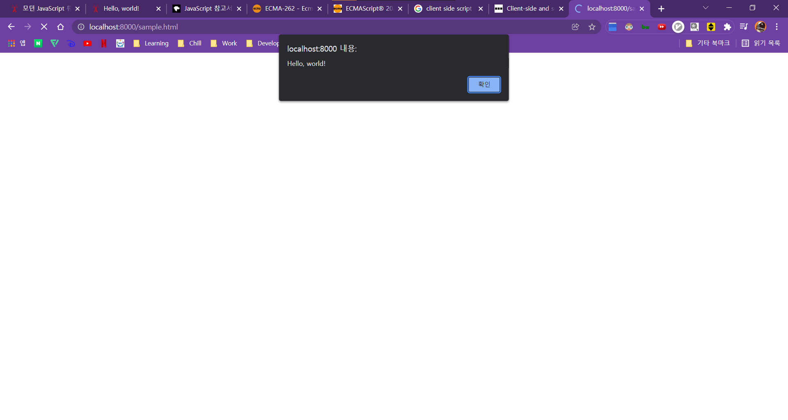
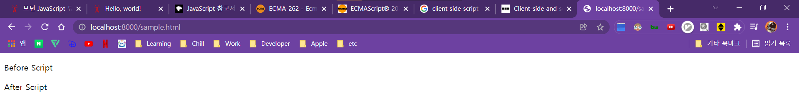
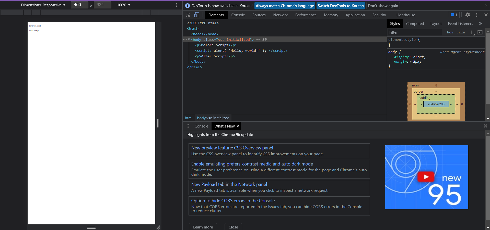

# JavaScript

## What is Javascript?

- **웹페이지에 생동감을 불어넣기 위해 만들어진 프로그래밍 언어**
    > 97%가 넘는 웹사이트들에서 클라이언트 사이드 웹페이지의 동작을 위해 JavaScript를 사용함. (출처 : 위키피디아)


- 관련 고유 명세서 : [ECMAScript](https://www.ecma-international.org/publications-and-standards/standards/ecma-262/) (ES6 ~ 현재 12까지 있음)


- JavaScript Engine으로 코드를 실행함.
  - [V8](https://v8.dev/)(Chrome, Opera)
  - [SpiderMonkey](https://spidermonkey.dev/)(Firefox)
  - 이외에도 다양한 엔진이 있고, 엔진별로 지원하는 기능 차이가 있음.


- 엔진 동작
  - 파싱 : 엔진이 스크립트를 읽는다.
  - 컴파일 : 읽어들인 스크립트를 기계어로 전환한다.
  - 실행 : 기계어로 전환된 코드가 실행된다.
  - 최적화 : 각 단계마다 최적화를 진행하여 실행 속도를 개선한다.


- HTML, CSS와 완전한 통합이 가능함


- JavaScript로 변환이 가능한 대체 언어들
  - [TypeScript](https://www.typescriptlang.org/) - Microsoft에서 개발한 언어. 자료형을 강제함.
  - [CoffeeScript](http://coffeescript.org/) - JavaScript의 문법을 단순화해 개발이 용이하도록 만든 언어.
  - [Dart](https://dart.dev/) - Google에서 개발한 모바일 앱과 같이 브라우저가 아닌 환경에서 동작하는 고유의 엔진을 가진 독자적 언어


- JavaScript 관련 상세 정보가 필요할 때 유용한 사이트들
  - [ECMA 명세서](https://www.ecma-international.org/publications-and-standards/standards/ecma-262/)
  - [MDN JavaScript Reference](https://developer.mozilla.org/en-US/docs/Web/JavaScript/Reference)
  - [브라우저 호환성 표](https://kangax.github.io/compat-table/es6/)
  - [기능별 호환성 체크](https://caniuse.com/)


## JavaScript 개발환경

- Editor
  - [VSCode](https://code.visualstudio.com/), [IntelliJ WebStrom](https://www.jetbrains.com/ko-kr/webstorm/) 등 IDE
  - [Vim](https://ko.wikipedia.org/wiki/Vim), [Emacs](https://namu.wiki/w/Emacs) 등 경량 에디터


- 코드 실행
  - Node.js 인터프리터로 코드를 실행할 수 있다. [(설치방법)](https://velog.io/@ywoosang/Node.js-%EC%84%A4%EC%B9%98)
    ```bash
    user@ip:~$ node helloworld.js
    Hello World!!
    user@ip:~$ cat helloworld.js
    console.log("Hello World!!")
    ```
  - html의 <script></script> 태그를 이용해 자바스크립트 코드를 삽입하고 브라우저에서 확인할 수 있다.


- 디버깅
  - JavaScript를 html 파일 내부에 포함시킨 후 브라우저의 개발자 도구를 이용해 디버깅이 가능하다.
    ```bash
    user@ip:~$ cat sample.html
    ```
    ```html
    <!DOCTYPE HTML>
    <html>

    <body>

    <p>Before Script</p>

    <script><!-- JavaScript 코드 -->
        alert( 'Hello, world!' );
    </script>

    <p>After Script</p>

    </body>

    </html>
    ```
    <a></a>
    <a></a>

    - 위 html 파일을 브라우저에서 실행했을 때의 모습.

    <a></a>

    - Chrome 브라우저의 개발자 도구를 실행한 모습.

## JavaScript 기본

### Hello, world!!

- script 태그
  - script 태그를 이용해 자바스크립트 코드를 html 파일에 삽입할 수 있음
  - 브라우저는 script 태그를 만나면 내부의 코드를 내장 엔진으로 처리함


- 모던 마크업
  - script 태그엔 몇 가지 attribute가 있음
  - `type` 속성: `<script type=...></script>`
    - 요즘엔 필수가 아니지만 HTML4(현재는 5)이전에는 script tag에 type attribute를 명시하는 것이 필수였음 `type="text/javascript"`
    - 현재는 type attribute를 자바스크립트 모듈에 사용함
  - `language` 속성: `<script language=...></script>`
    - 현재 사용하고 있는 스크립트 언어를 나타냄
    - 자바스크립트가 기본 언어이므로 속성의 의미가 퇴색된 상황


- 외부 스크립트
  - 자바스크립트 코드 양이 많은 경우 파일로 저장하여 삽입할 수 있음
    ```html
    <script src="/path/to/script.js"></script>
    ```
    ```html
    <script src="https://cdnjs.cloudflare.com/ajax/libs/lodash.js/4.17.11/lodash.js"></script>
    ```
  - 스크립트를 별도의 파일에 작성하면 브라우저에서 다운받아 [캐시](https://ko.wikipedia.org/wiki/%EC%9B%B9_%EC%BA%90%EC%8B%9C)에 저장하기 때문에 성능상의 이점이 있음
  - ```src```속성이 있으면 태그 내부 코드는 무시됨
    ```html
    <script src="file.js">
      alert(1); // src 속성이 사용되었으므로 이 코드는 무시
    </script>
    ```

### 코드 구조
- 명령문
  - 아래의 세 코드는 모두 같은 동작을 함
    ```javascript
    //세미콜론으로 같은 줄의 명령문을 구분할 수 있음
    alert('Hello'); alert('World');
    //코드 가독성을 위해 일반적으로 다른 줄에 명령문을 작성함
    alert('Hello');
    alert('World');
    //줄 바꿈이 있다면 세미콜론 생략 가능
    alert('Hello')
    alert('World')
    ```
  - [세미콜론 자동 삽입의 한계](https://weicomes.tistory.com/135)
  - 세미콜론 생략에 한계가 있기 때문에 커뮤니티에서는 세미콜론을 명시하도록 권장하고 있음


- 주석
  - 한 줄 주석
    ```javascript
    //한 줄 주석
    console.log("Hello, World!!")
    ```
  - 여러 줄 주석
    ```javascript
    /*
    여러 줄 주석
    여러 줄 주석
    */
    console.log("Hello, World!!")
    ```

### Strict 모드
- 하위 호환성 문제
  - 자바스크립트는 오랫동안 호환성 이슈가 없었음
  - ES5에서 기존 언어의 결점을 수정하면서 일부 기능이 변경되며 하위 호환성 이슈가 나오게 됨
  - `"use strict"`라는 지시자를 통해 Strict 모드를 활성화해야만 모던 자바스크립트로 동작하도록 만듦


- use strict
  - 스크립트의 최상단에 `"use strict";`라고 명시해두면 스크립트 전체가 모던 자바스크립트로 동작하게 됨 (중간에 있을 경우 활성화되지 않음)
  - 함수 내부의 최상단에 위치할 경우 해당 함수만 Strict 모드로 실행됨


- 모던 자바스크립트의 클래스와 모듈 사용시 Strict 모드 자동 적용됨

### 자료형
- 변수 선언
  - `let`키워드를 사용해 변수를 생성함
    ```javascript
    let message;
    message = "Hello World!";
    ```
  - 코드가 오래된 경우 ```var```키워드를 사용하기도 함
  - 변수를 두 번 선언하면 에러가 발생함
    ```javascript
    let message = "This";
    let message = "That"; // SyntaxError: 'message' has already been declared
    ```
  - 함수형 프로그래밍 언어
    - Scala, Erlang 등의 함수형 프로그래밍 언어에서는 변숫값 변경을 금지함


- 변수 명명 규칙
  1. 변수명에는 오직 문자와 숫자, 그리고 기호 `$`와 `_`만 들어갈 수 있음.
  2. 첫 글자는 숫자가 될 수 없음
  3. 대·소문자 구별
  4. 키릴 문자, 상형문자 등 모든 언어를 변수명에 사용할 수 있음. 영어를 사용해서 만드는 것을 권장함.
  5. [예약어(reserved name) 목록](https://developer.mozilla.org/en-US/docs/Web/JavaScript/Reference/Lexical_grammar#Keywords)에 있는 단어는 변수명으로 사용할 수 없음
  - 유효한 변수명 예시
    ```javascript
    let userName;
    let test123;
    let $ = 1;
    let _ = 2;
    alert($ + _); // 3
    ```
    - 여러 단어를 조합하여 변수명을 만들 땐 [카멜 표기법(camelCase)](https://en.wikipedia.org/wiki/Camel_case), [뱀 표기법(snake_case)](https://en.wikipedia.org/wiki/Snake_case) 등이 흔히 사용됨
  - 잘못된 변수명 예시
    ```javascript
    let 1a;
    let my-name;
    ```


- 상수
  - 고정된 변수를 선언할 땐 `let`대신 `const`를 사용함
    ```javascript
    const myBirthday = '1996.09.17';
    ```
  - `const`로 선언한 변수를 상수라고 부름
  - 상수 변수를 변경하려고 시도하면 에러가 발생함
  - 하드코딩되는 값을 대문자 상수로 할당하는 관습이 있음
    ```javascript
    const COLOR_RED = "#F00"; // 기억하기 쉬운 상수로 선언
    const COLOR_GREEN = "#0F0"; // 의미를 알기 어려운 값을 유의미한 대문자 상수로 선언
    const COLOR_BLUE = "#00F";
    const COLOR_ORANGE = "#FF7F00";
    ```


- 동적 타입 언어
  - 자바스크립트에는 여덟 가지 기본 자료형이 있음
  - 변수에는 문자열과 숫자 모두 담을 수 있으며, 변수에 저장되는 값의 타입은 언제든지 바뀔 수 있음


- 숫자형
  - 정수 및 부동소수점 숫자가 있음
  - 곱셈 `*`, 나눗셈 `/`, 덧셈 `+`, 뺄셈 `-` 등의 숫자형 관련 연산이 있음
  - `Infinity`, `-Infinity`, `NaN`같은 특수 숫자 값이 포함됨
    ```javascript
    let n = 123;
    n = 12.345;
    alert(1/0); // 무한대
    alert( Infinity ); // 무한대
    alert( "숫자가 아님" / 2 ); // NaN
    alert( "숫자가 아님" / 2 + 5 ); // NaN
    ```
  - 안전한 수학 연산
    > 자바스크립트에서의 수학 연산은 안전하다고 볼 수 있습니다. 0으로 나눈다거나 숫자가 아닌 문자열을 숫자로 취급하는 등의 이례적인 연산이 자바스크립트에선 가능합니다.
    > 말이 안 되는 수학 연산을 하더라도 스크립트는 치명적인 에러를 내뿜으며 죽지 않습니다. `NaN`을 반환하며 연산이 종료될 뿐입니다.


- BigInt
  - $(2^{53}-1)$보다 큰 값 혹은 $-(2^{53}-1)$보다 작은 정수는 숫자형을 사용해 나타낼 수 없음
  - [BigInt에 대한 설명](https://ko.javascript.info/bigint)


- 문자형
  - 문자열은 따옴표로 묶는다
    ```javascript
    let str = "Hello";
    let str2 = 'Single quotes are ok too';
    let phrase = `can embed another ${str}`;
    ```
  - 따옴표는 세 종류가 있음
    1. 큰따옴표 : `"Hello"`
    2. 작은따옴표 : `'Hello'`
    3. 역따옴표 : <code>\`Hello`</code>
  - 큰따옴표와 작은따옴표는 기본적인 문자열
  - 역따옴표에는 아래와 같이 원하는 변수나 표현식을 문자열 중간에 넣을 수 있음
    ```javascript
    let name = "John";

    // 변수를 문자열 중간에 삽입
    alert( `Hello, ${name}!` ); // Hello, John!

    // 표현식을 문자열 중간에 삽입
    alert( `the result is ${1 + 2}` ); // the result is 3
    ```


- boolean형
  - boolean형은 `true`, `false` 두 가지 값만 가진다
    ```javascript
    let isGreater = 4 > 1;

    alert( isGreater ); // true
    ```


- null값
  - 일반적인 언어에서 `null`은 존재하지 않는 객체에 대한 참조나 널포인터를 나타낼 때 사용하지만 자바스크립트에서는 존재하지 않는 값, 비어있는 값, 알 수 없는 값을 나타내는 데 사용함


- undefined값
  - `undefined`는 값이 할당되지 않은 상태를 나타낼 때 사용함
    ```javascript
    let age;

    alert(age); // 'undefined'

    let num = 100;

    num = undefined;

    alert(num); // "undefined"
    ```


- 객체와 심볼
  - 객체형을 제외한 다른 자료형은 문자열이든 숫자든 한 가지만 표현할 수 있기 때문에 원시(primitive) 자료형이라 부릅니다. 반면 객체는 데이터 컬렉션이나 복잡한 개체(entity)를 표현할 수 있습니다.
  - 심볼(symbol)형은 객체의 고유한 식별자(unique identifier)를 만들 때 사용됩니다.


- typeof 연산자
  ```javascript
  typeof undefined // "undefined"

  typeof 0 // "number"

  typeof 10n // "bigint"

  typeof true // "boolean"

  typeof "foo" // "string"

  typeof Symbol("id") // "symbol"

  typeof Math // "object" Math는 수학 연산을 제공하는 내장 객체임

  typeof null // "object" javascript 언어 자체 오류. null은 원래 객체가 아님.

  typeof alert // "function" 함수형은 객체에 속하지만 오래전 만들어진 명세 규칙이기 때문에 하위 호환성 유지를 위해 남겨둔 상태임
  ```


- 요약
  > - 자바스크립트에는 여덟 가지 기본 자료형이 있습니다.
  > - 숫자형 – 정수, 부동 소수점 숫자 등의 숫자를 나타낼 때 사용합니다. 정수의 한계는 ±$2^{53}$ 입니다.
  > - bigint – 길이 제약 없이 정수를 나타낼 수 있습니다.
  > - 문자형 – 빈 문자열이나 글자들로 이뤄진 문자열을 나타낼 때 사용합니다. 단일 문자를 나타내는 별도의 자료형은 없습니다.
  > - 불린형 – true, false를 나타낼 때 사용합니다.
  > - null – null 값만을 위한 독립 자료형입니다. null은 알 수 없는 값을 나타냅니다.
  > - undefined – undefined 값만을 위한 독립 자료형입니다. undefined는 할당되지 않은 값을 나타냅니다.
  > - 객체형 – 복잡한 데이터 구조를 표현할 때 사용합니다.
  > - 심볼형 – 객체의 고유 식별자를 만들 때 사용합니다.
  > - typeof 연산자는 피연산자의 자료형을 알려줍니다.
  >   - typeof x 또는 typeof(x) 형태로 사용합니다.
  >   - 피연산자의 자료형을 문자열 형태로 반환합니다.
  >   - null의 typeof 연산은 "object"인데, 이는 언어상 오류입니다. null은 객체가 아닙니다.

## 상호작용 (alert, prompt, confirm)
- 브라우저 환경에서 사용되는 최소한의 사용자 인터페이스 기능인 alert, prompt, confirm에 대해 알아보자

- alert
  - `alert`함수가 실행되면 사용자가 확인 버튼을 누를 때까지 메시지를 보여주는 창이 계속 떠있음
  - 이러한 작은 창은 *모달 창(modal window)*라고 부름. 사용자는 확인 버튼을 누르기 전까지는 모달 창 바깥에 있는 버튼을 누른다든가 하는 행동을 할 수 없음.

- prompt
  - 브라우저에서 제공하는 `prompt`함수는 두 개의 인수를 받는다.
    ```javascript
    result = prompt(title, [default]);
    ```
    > 인수를 감싸는 대괄호 `[...]`의 의미는 해당 매개변수가 필수가 아닌 선택값이라는 것을 의미합니다.
  - 함수가 실행되면 텍스트 메시지와 입력 필드(input field), 확인(Ok) 및 취소(Cancel) 버튼이 있는 모달 창을 띄워줍니다.
  - `title` : 사용자에게 보여줄 문자열
  - `default` : 입력 필드의 초깃값(선택값)
  - 사용자는 프롬프트 대화상자의 입력 필드에 원하는 값을 입력하고 확인을 누를 수 있음.
  - 값 입력을 원하지 않는 경우 취소(cancel) 버튼을 누르거나 Esc를 눌러 대화상자를 빠져나간다.
  - `prompt`함수는 사용자가 입력 필드에 기재한 문자열을 반환함. 사용자가 입력을 취소한 경우는 `null`이 반환된다.

- confirm 대화상자
  - `confirm`함수는 매개변수로 받은 `question`과 확인 및 취소 버튼이 있는 모달 창을 보여준다.
  - 사용자가 확인 버튼을 누르면 `true`, 그 외의 경우는 `false`를 반환한다.
    ```javascript
    let isBoss = confirm("당신이 주인인가요?");
    alert( isBoss ); // 확인 버튼을 눌렀다면 true가 출력됩니다.
    ```

- 요약
  > 브라우저는 사용자와 상호작용할 수 있는 세 가지 함수를 제공합니다.
  > - `alert` : 메시지를 보여줍니다.
  > - `prompt` : 사용자에게 텍스트를 입력하라는 메시지를 띄워줌과 동시에, 입력 필드를 함께 제공합니다. 확인을 누르면 prompt 함수는 사용자가 입력한 문자열을 반환하고, 취소 또는 Esc를 누르면 null을 반환합니다.
  > - `confirm` : 사용자가 확인 또는 취소 버튼을 누를 때까지 메시지가 창에 보여집니다. 사용자가 확인 버튼을 누르면 true를, 취소 버튼이나 Esc를 누르면 false를 반환합니다.
  > - 위 함수들은 모두 모달 창을 띄워주는데, 모달 창이 떠 있는 동안은 스크립트의 실행이 일시 중단됩니다. 사용자가 창을 닫기 전까진 나머지 페이지와 상호 작용이 불가능합니다.
  > - 지금까지 살펴본 세 함수엔 두 가지 제약사항이 있습니다.
  >   - 모달 창의 위치는 브라우저가 결정하는데, 대개 브라우저 중앙에 위치합니다.
  >   - 모달 창의 모양은 브라우저마다 다릅니다. 개발자는 창의 모양을 수정할 수 없습니다.
  > - 이런 제약사항은 간결성을 위해 치러야 할 대가입니다. 창을 더 멋지게 꾸미고 복잡한 상호작용을 가능하게 해주는 다른 방법도 있긴 하지만, '멋을 위한 부가 기능’이 필요하지 않다면 지금까지 소개해드린 기본 메서드만으로 충분합니다.

